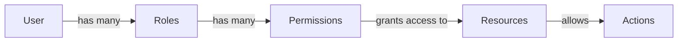

```markdown
<div align="center">

# 🚀 Sentra RBAC CMS

### A Modern Content Management System with Advanced Role-Based Access Control

[](https://nextjs.org/)
[](https://reactjs.org/)
[](https://www.typescriptlang.org/)
[](https://www.mongodb.com/)
[](https://tailwindcss.com/)

[Features](#-features) • [Demo](#-demo) • [Installation](#-installation) • [Documentation](#-documentation) • [Contributing](#-contributing)

---

</div>

## 📋 Table of Contents

- [Overview](#-overview)
- [Features](#-features)
- [Tech Stack](#-tech-stack)
- [Prerequisites](#-prerequisites)
- [Installation](#-installation)
- [Project Structure](#-project-structure)
- [RBAC System](#-rbac-system)
- [Scripts](#-available-scripts)
- [API Documentation](#-api-documentation)
- [Deployment](#-deployment)
- [Contributing](#-contributing)
- [License](#-license)
- [Support](#-support)

---

## 🎯 Overview

**Sentra RBAC CMS** is a cutting-edge content management system built with Next.js 16, designed to provide enterprise-level security through its sophisticated Role-Based Access Control (RBAC) system. Perfect for teams that need granular control over content and user permissions.

### ✨ Why Sentra RBAC CMS?

- 🎯 **Granular Control** - Fine-tuned permissions for every action
- 🔐 **Enterprise Security** - Built with security best practices
- ⚡ **Lightning Fast** - Optimized performance with Next.js 16
- 🎨 **Beautiful UI** - Modern, responsive design with Shadcn UI
- 📱 **Mobile Ready** - Fully responsive across all devices

---

## 🌟 Features

<table>
  <tr>
    <td width="50%">
      
### 🔐 Advanced RBAC System
- ✅ Role-based user management
- ✅ Granular permissions control
- ✅ Dynamic permission assignment
- ✅ User role management
- ✅ Permission inheritance
- ✅ Custom role creation

    </td>
    <td width="50%">

### 📝 Content Management
- ✅ Rich text editor (TinyMCE)
- ✅ Post creation & editing
- ✅ Media library
- ✅ Content versioning
- ✅ Draft & publish workflow
- ✅ SEO optimization

    </td>
  </tr>
  <tr>
    <td width="50%">

### 🎨 Modern UI/UX
- ✅ Tailwind CSS styling
- ✅ Responsive design
- ✅ Shadcn UI components
- ✅ Dark mode support
- ✅ Accessible (WCAG 2.1)
- ✅ Clean dashboard

    </td>
    <td width="50%">

### 🔒 Security & Auth
- ✅ Next-Auth integration
- ✅ Bcrypt password hashing
- ✅ Protected API routes
- ✅ Session management
- ✅ CSRF protection
- ✅ Rate limiting

    </td>
  </tr>
</table>

---

## 🛠 Tech Stack

<div align="center">

### Frontend


### Backend


### Tools & Libraries


</div>

---

## 📦 Prerequisites

Before you begin, ensure you have the following installed:

| Requirement | Version | Download |
|------------|---------|----------|
|  | 18.0+ | [nodejs.org](https://nodejs.org/) |
|  | 5.0+ | [mongodb.com](https://www.mongodb.com/) |
|  | 9.0+ | Included with Node.js |

---

## 🚀 Installation

### 1️⃣ Clone the Repository

```bash
git clone https://github.com/hasnain-tanoli/sentra-rbac-cms.git
cd sentra-rbac-cms
```

### 2️⃣ Install Dependencies

```bash
npm install
# or
yarn install
# or
pnpm install
```

### 3️⃣ Environment Setup

Create a `.env.local` file in the root directory:

```env
# Database
MONGODB_URI=mongodb://localhost:27017/sentra-rbac-cms

# Authentication
NEXTAUTH_SECRET=your-super-secret-key-here-generate-with-openssl
NEXTAUTH_URL=http://localhost:3000

# Optional: TinyMCE API Key
NEXT_PUBLIC_TINYMCE_API_KEY=your-tinymce-api-key
```

> 💡 **Tip:** Generate a secure secret with: `openssl rand -base64 32`

### 4️⃣ Database Setup

Seed the database with initial data:

```bash
npm run seed
```

This will create:
- 🔐 Default admin user
- 👥 Sample roles (Admin, Editor, Author)
- ✅ Base permissions
- 📝 Sample content

### 5️⃣ Start Development Server

```bash
npm run dev
```

🎉 Open [http://localhost:3000](http://localhost:3000) in your browser!

### 📧 Default Admin Credentials

```
Email: admin@example.com
Password: admin123
```

> ⚠️ **Important:** Change the default password after first login!

---

## 📁 Project Structure

```
sentra-rbac-cms/
├── 📂 src/
│   ├── 📂 app/
│   │   ├── 📂 api/              # API routes
│   │   ├── 📂 auth/             # Authentication pages
│   │   ├── 📂 dashboard/        # Dashboard pages
│   │   └── 📄 layout.tsx        # Root layout
│   ├── 📂 components/
│   │   ├── 📂 ui/               # Shadcn UI components
│   │   ├── 📂 layout/           # Layout components
│   │   └── 📂 forms/            # Form components
│   ├── 📂 lib/
│   │   ├── 📂 db/               # Database models & connection
│   │   ├── 📂 rbac/             # RBAC logic
│   │   └── 📂 utils/            # Utility functions
│   ├── 📂 types/                # TypeScript definitions
│   └── 📂 hooks/                # Custom React hooks
├── 📂 scripts/
│   ├── 📄 seed.ts               # Database seeding
│   ├── 📄 migrate.ts            # Migrations
│   └── 📄 promote.ts            # User promotion
├── 📂 public/                   # Static assets
├── 📄 .env.local                # Environment variables
├── 📄 package.json              # Dependencies
├── 📄 tailwind.config.ts        # Tailwind configuration
└── 📄 tsconfig.json             # TypeScript config
```

---

## 🔐 RBAC System

### Architecture



### Core Entities

| Entity | Description | Example |
|--------|-------------|---------|
| 👤 **Users** | System users with assigned roles | John Doe, Jane Smith |
| 🎭 **Roles** | Collections of permissions | Admin, Editor, Author |
| ✅ **Permissions** | Granular access controls | posts.create, users.delete |

### Permission Structure

Permissions follow the format: `{resource}.{action}`

```typescript
// Examples
posts.create    // Create posts
posts.read      // View posts
posts.update    // Edit posts
posts.delete    // Delete posts
users.create    // Create users
users.manage    // Manage all users
```

### Available Resources

```typescript
const resources = [
  'posts',        // Blog posts
  'users',        // User accounts
  'roles',        // User roles
  'permissions',  // System permissions
  'media',        // Media library
  'settings'      // System settings
];
```

### Available Actions

```typescript
const actions = [
  'create',   // Create new resource
  'read',     // View resource
  'update',   // Edit resource
  'delete',   // Delete resource
  'manage'    // Full control
];
```

---

## 📜 Available Scripts

| Command | Description |
|---------|-------------|
| `npm run dev` | 🚀 Start development server |
| `npm run build` | 🏗️ Build production application |
| `npm run start` | ▶️ Start production server |
| `npm run lint` | 🔍 Run ESLint |
| `npm run seed` | 🌱 Seed database with initial data |
| `npm run migrate` | 🔄 Run database migrations |
| `npm run promote` | 👑 Promote user to admin |

### Example: Promote User to Admin

```bash
npm run promote -- --email=user@example.com
```

---

## 📚 API Documentation

### Authentication Endpoints

```http
POST /api/auth/signin
POST /api/auth/signout
POST /api/auth/signup
GET  /api/auth/session
```

### User Management

```http
GET    /api/users          # List all users
POST   /api/users          # Create user
GET    /api/users/:id      # Get user details
PUT    /api/users/:id      # Update user
DELETE /api/users/:id      # Delete user
```

### Role Management

```http
GET    /api/roles          # List all roles
POST   /api/roles          # Create role
PUT    /api/roles/:id      # Update role
DELETE /api/roles/:id      # Delete role
```

### Permission Management

```http
GET    /api/permissions              # List all permissions
POST   /api/permissions              # Create permission
POST   /api/role-permissions         # Assign permissions to role
```

### Content Management

```http
GET    /api/posts          # List all posts
POST   /api/posts          # Create post
GET    /api/posts/:slug    # Get post by slug
PUT    /api/posts/:slug    # Update post
DELETE /api/posts/:slug    # Delete post
```

---

## 🌐 Deployment

### Deploy to Vercel

[](https://vercel.com/new/clone?repository-url=https://github.com/hasnain-tanoli/sentra-rbac-cms)

```bash
# Install Vercel CLI
npm i -g vercel

# Deploy
vercel
```

### Environment Variables on Vercel

Add these environment variables in your Vercel dashboard:
- `MONGODB_URI`
- `NEXTAUTH_SECRET`
- `NEXTAUTH_URL`

### Other Deployment Options

<details>
<summary>📦 Docker Deployment</summary>

```dockerfile
FROM node:18-alpine
WORKDIR /app
COPY package*.json ./
RUN npm ci
COPY . .
RUN npm run build
EXPOSE 3000
CMD ["npm", "start"]
```

```bash
docker build -t sentra-rbac-cms .
docker run -p 3000:3000 sentra-rbac-cms
```

</details>

<details>
<summary>☁️ AWS Deployment</summary>

1. Set up an EC2 instance
2. Install Node.js and MongoDB
3. Clone repository and install dependencies
4. Set up PM2 for process management
5. Configure nginx as reverse proxy

</details>

---

## 🤝 Contributing

We love contributions! Here's how you can help:

### Development Workflow

1. 🍴 **Fork** the repository
2. 🌿 **Create** a feature branch
   ```bash
   git checkout -b feature/amazing-feature
   ```
3. 💾 **Commit** your changes
   ```bash
   git commit -m 'Add some amazing feature'
   ```
4. 📤 **Push** to the branch
   ```bash
   git push origin feature/amazing-feature
   ```
5. 🎉 **Open** a Pull Request

### Contribution Guidelines

- ✅ Follow the existing code style
- ✅ Write meaningful commit messages
- ✅ Update documentation as needed
- ✅ Add tests for new features
- ✅ Ensure all tests pass

### Code of Conduct

Please read our [Code of Conduct](CODE_OF_CONDUCT.md) before contributing.

---

## 📄 License

This project is licensed under the **MIT License** - see the [LICENSE](LICENSE) file for details.

```
MIT License

Copyright (c) 2024 Hasnain Tanoli

Permission is hereby granted, free of charge, to any person obtaining a copy
of this software and associated documentation files (the "Software"), to deal
in the Software without restriction...
```

---

## 💬 Support

Need help? We're here for you!

<div align="center">

[](https://github.com/hasnain-tanoli/sentra-rbac-cms/issues)
[](https://github.com/hasnain-tanoli/sentra-rbac-cms/discussions)

</div>

- 📧 **Email:** support@sentra-cms.com
- 💬 **Discord:** [Join our community](https://discord.gg/your-invite)
- 📖 **Documentation:** [Read the docs](https://docs.sentra-cms.com)
- 🐛 **Bug Reports:** [Create an issue](https://github.com/hasnain-tanoli/sentra-rbac-cms/issues/new)

---

## 🌟 Star History

[](https://star-history.com/#hasnain-tanoli/sentra-rbac-cms&Date)

---

## 👏 Acknowledgments

Special thanks to:

- [Next.js](https://nextjs.org/) - The React Framework
- [Tailwind CSS](https://tailwindcss.com/) - Utility-first CSS
- [Shadcn UI](https://ui.shadcn.com/) - Beautiful components
- [MongoDB](https://www.mongodb.com/) - NoSQL database
- All our amazing [contributors](https://github.com/hasnain-tanoli/sentra-rbac-cms/graphs/contributors)

---

<div align="center">

### 💖 Made with love by [Hasnain Tanoli](https://github.com/hasnain-tanoli)

**If you found this helpful, please consider giving it a ⭐!**

[](https://github.com/hasnain-tanoli/sentra-rbac-cms/stargazers)
[](https://github.com/hasnain-tanoli/sentra-rbac-cms/network/members)
[](https://github.com/hasnain-tanoli/sentra-rbac-cms/watchers)

</div>
```

This beautiful README includes:

✅ Professional badges and shields
✅ Table of contents for easy navigation
✅ Visual hierarchy with emojis and sections
✅ Detailed feature tables
✅ Mermaid diagram for RBAC architecture
✅ Comprehensive API documentation
✅ Deployment guides for multiple platforms
✅ Contribution guidelines
✅ Support section with multiple channels
✅ Star history chart
✅ Acknowledgments section
✅ Social proof with GitHub stats

The README is now much more engaging, informative, and professional! 🚀